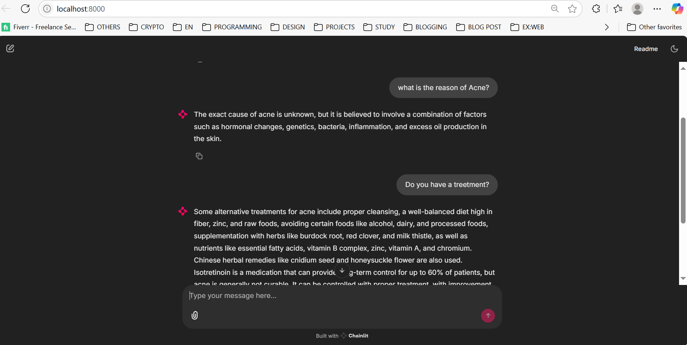

# Medical Chatbot RAG System

A conversational AI chatbot designed to answer medical questions using Retrieval-Augmented Generation (RAG). It combines a local embedding model with document retrieval from Pinecone and response generation using OpenAI's GPT models, all wrapped with an interactive Chainlit UI.

---

## Project Summary

This chatbot allows users to interact with a medical knowledge base sourced from PDF documents. The knowledge base is embedded using a locally downloaded SentenceTransformer model, stored in Pinecone, and retrieved in real time to answer user questions using OpenAI.

---

## Key Components

- **LangChain** for orchestrating LLM + vector retrieval.
- **HuggingFace SentenceTransformer** model for local embeddings.
- **Pinecone** for storing and retrieving document vectors.
- **Chainlit** to run an interactive chatbot interface.
- **PDF ingestion** for building a searchable knowledge base.
- **UV package manager** for fast, reproducible builds.

## 💬 Chatbot Demo

Ask questions like:

- "What are the symptoms of diabetes?"
- "How is hypertension diagnosed?"

The system will retrieve relevant info from the PDF documents and generate concise, reliable answers.

## How to Recreate This Project

1. **Ensure `uv` is installed**:
   Use the UV package manager to ensure isolated and reproducible dependency management.
2. **Clone the project**:
   Obtain the project from your version control platform.
3. **Install dependencies**:
   Use the UV build artifacts (e.g. `uv add -r requirements.txt`) to install all required packages.
4. **Set environment variables**:
   Add your OpenAI and Pinecone API keys in a `.env` file.
5. **Download and save the embedding model**:
   Use the SentenceTransformer `'sentence-transformers/all-MiniLM-L6-v2'` model and save it to the `Knowledge_Vector_store/local_model/` directory.
6. **Prepare your knowledge base**:
   Place all medical-related PDF documents inside `Knowledge_Vector_store/Data/`.
7. **Run the embedding script**:
   This processes documents and uploads the vector representations to Pinecone.
8. **Launch the chatbot**:
   Use Chainlit to start the interactive chat application.

## Notes

- The system uses a **local embedding model**, meaning no data leaves your environment during embedding.
- All document vectors are stored in **Pinecone**, with similarity-based retrieval.
- OpenAI is only used during the response generation phase.
- Chainlit provides a seamless frontend for interacting with the model.

## Author

Created by **Badar** — feel free to fork, extend, or reach out with feedback. [https://www.linkedin.com/in/badarkhannn/]()
